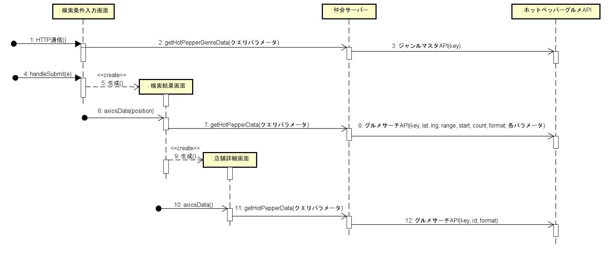

# 簡易仕様書サンプル

### 作者
野呂田 遼

### アプリ名
レストラン検索ウェブアプリ

#### コンセプト
- 近くのお店を簡単検索。
- 地域などの情報を入力しなくても、ジャンルや絞り込みだけで検索可能！

#### こだわったポイント
- - reactを使いつつも、URLでパラメータなどを保持し、前回の状態に戻ることが出来るようにしました。
- ジャンルはhtmlにべた書きしたのではなく、APIを利用して取得するようにした。
- ローカルで開くとホットペッパーグルメAPIとの通信時にCORSエラーが発生していたため、仲介サーバーをたてて、通信するようにした。

#### デザイン面でこだわったポイント
- 絞り込み検索をいつでも変更可能にしています。絞り込みリストが付いてくるようにしたため、探すストレスなどなく行えるようにしました。
- マップも活用し、質素すぎる画面にならないようにしました。

### 該当プロジェクトのリポジトリ URL（GitHub,GitLab など Git ホスティングサービスを利用されている場合）
https://github.com/ryo1294/RestaurantSearchWebApp

 
## 開発環境
### 開発環境
VSCode 1.85.2

### 開発言語
JavaScript

## 動作対象端末・OS
### 動作対象OS
-	Chrome	バージョン：120.0.6099.225
-	Edge		バージョン：120.0.2210.144
-	Firefox	バージョン：121.0.1

## 開発期間
5日間

## フレームワーク
React  バージョン：18.2.0

## テーブル定義（ER図）などの設計ドキュメント
[シーケンス図]

 
 
## アプリケーション機能

### 機能一覧
- レストラン検索           ：ホットペッパーグルメサーチAPIを使用して、現在地周辺の飲食店を検索する。
- レストラン検索（ジャンル）：ホットペッパーグルメサーチAPIを使用して、現在地周辺の飲食店をジャンル検索する。
- レストラン検索（絞り込み）：ホットペッパーグルメサーチAPIを使用して、現在地周辺の飲食店を絞り込み検索する。
- レストラン情報取得        ：ホットペッパーグルメサーチAPIを使用して、飲食店の詳細情報を取得する。
- 地図（OSM）表示          ：飲食店の所在地をOpenStreetMap地図で表示している。

### 画面一覧
- 検索条件入力画面 ：条件を指定してレストランを検索する。
- 検索結果一覧画面 ：検索結果の飲食店を一覧表示する。
- 店舗詳細画面　　 ：選択された飲食店の詳細を表示する。

### 使用しているAPI,SDK,ライブラリなど
- ホットペッパーグルメサーチAPI
- React    バージョン：18.2.0
- Node.js　バージョン：20.9.0

### アドバイスして欲しいポイント
- 詳細が薄くなってしまった気がする。もっと見栄えを良くしたい。

## 自己評価
はじめてReactを利用したが、やりたいことを実現することができてよかったです。\
また、こうした仕様書を作るのは初めてなので、見にくいものになってしまっているかもしれません。\
今回のWebアプリは、Reactを利用しつつもURLでパラメータなどを保持し、前回の状態に戻ることが出来るようにしており、\
利用者にできるだけストレスがかからないように工夫しました。\
絞り込みも一覧画面などにずっと表示されるようにし、すぐに再検索することが可能になっています。\
こういったこだわりを体言し、作ることが出来たので良かったです。\
ただ、アドバイスして欲しいポイントにも書きましたが、詳細が薄くなってしまった気がするのでもっとよくできれば\
良かったと感じています。

## 起動方法
・githubからコードを取得\
・npm install\
・npm start → [http://localhost:3000]が開く
